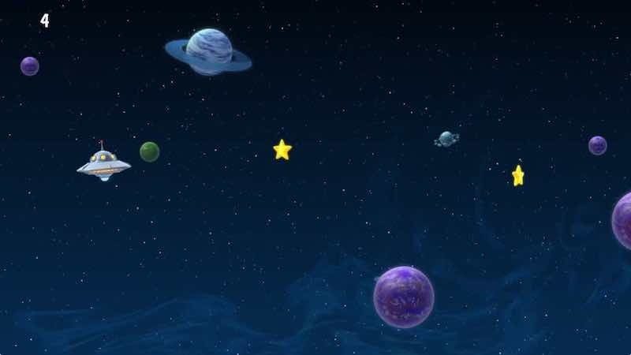
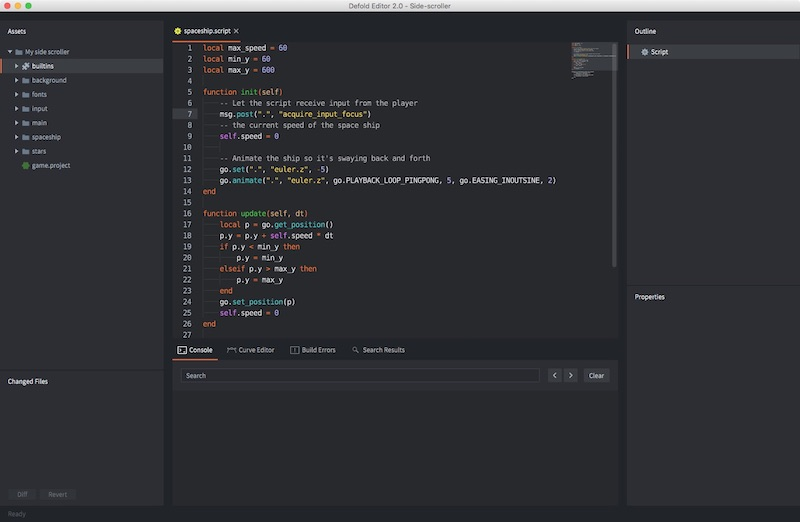
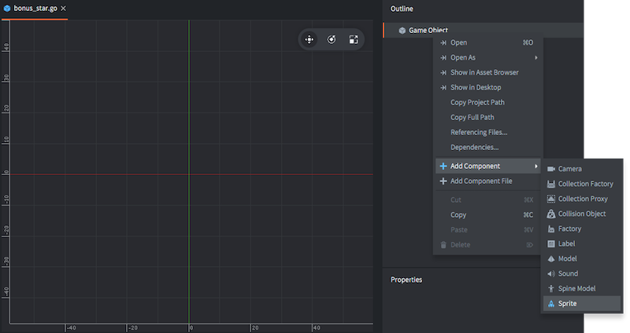
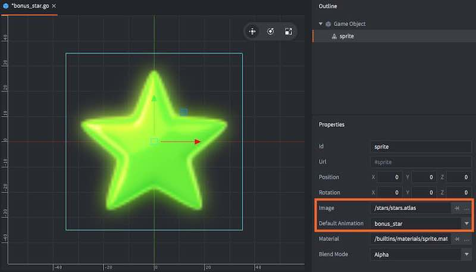
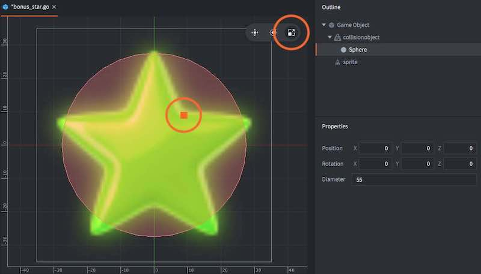
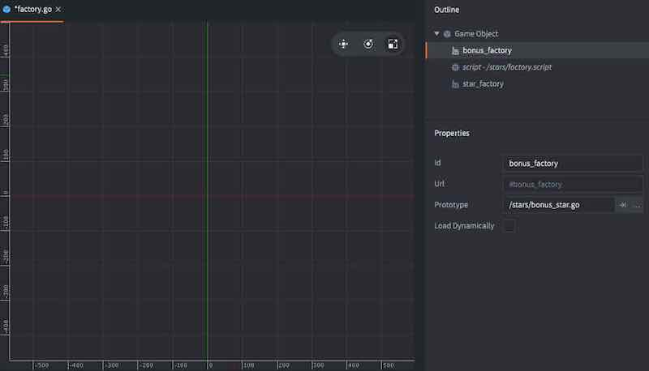
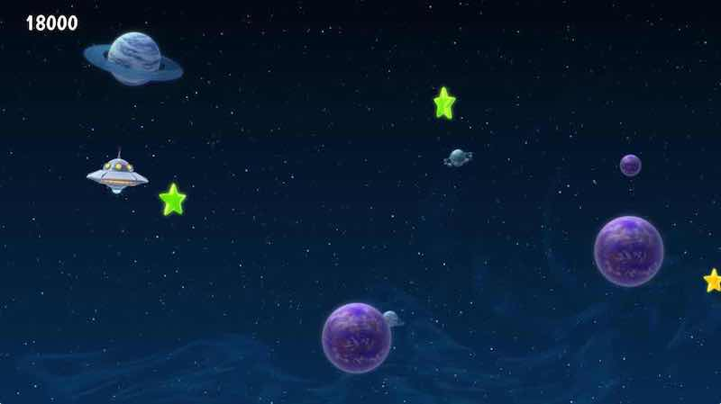

# Side scroller tutorial

<a href="https://www.defold.com" target="_blank">Test</a>

Welcome to the side scroller Defold tutorial. The game you will work with is extremely simple. The player controls a space ship and is supposed to collect stars that appear on the screen. The ship is controlled with the up and down arrow keys on the keyboard.

The game is already set up for you so you need only to [build and run](defold://build) the game to try it. (You can also select <kbd>Project ▸ Build</kbd> in the menu to build and run)



Try steering the space ship with the arrow keys and pick up stars for points.

## Tweaking the game

The game is currently not much fun, but you can easily improve it with some simple tweaks. You will do the update tweaks to the game live so make sure that you keep the game running somewhere on your desktop.

First, let’s adjust the speed of the space ship:

1. Open the file [spaceship.script](defold://open?resource=/spaceship/spaceship.script) with the menu item <kbd>File ▸ Open Asset...</kbd>

   

2. Type the word "space" to searching among all the available assets and select the file "spaceship.script". Click the button <kbd>Open</kbd> to open the file in the Lua code editor.

   

3. At the top of the file, change the line:

   ```lua
   local max_speed = 60
   ```

   to:

   ```lua
   local max_speed = 150
   ```

   This will increase the movement speed of the space ship.

4. Reload the script file into the running game with <kbd>File ▸ Hot Reload</kbd>.

Try moving the space ship with the arrow-keys on your keyboard. Notice how the it moves faster now.

Currently, the player only gets 1 point for each star collected. More score is more fun so let’s fix that.

1. Open the file "star.script". Either use <kbd>File ▸ Open Asset...</kbd> or find the file in the *Assets* browser in the leftmost editor pane and double click it. The file is in the folder named "star".

2. At the top of the file, change:

   ```lua
   local score = 1
   ```

   to:

   ```lua
   local score = 1000
   ```

3. Reload the script file into the running game with <kbd>File ▸ Hot Reload</kbd>.

Try to collect some stars and notice how the score has dramatically increased.

## Adding bonus stars


The game would perhaps be a bit more interesting if bonus stars would appear now and then. In order to make that happen, you need to create a new *game object file*, which will work as a blueprint for the new type of star.

1. Add a new game object file. Right-click the "stars" folder in the *Assets* view and select <kbd>New... ▸ Game Object</kbd>. Name the new file "bonus_star". (The editor will automaticaly append a file type suffix so the full name will be "bonus_star.go".)

   

2. The editor automatically opens the new file so you can edit it.

3. Add a *Sprite* component to the game object. Right-click the root of the *Outline* view and select <kbd>Add Component ▸ Sprite</kbd>. This allows you to attach graphics to the bonus star.

   

In the Outline view, you will see a new item called "sprite". When it is clicked, its properties are displayed in the *Properties* view below. The sprite currently has no graphics attached so you need to do that:

1. Set the *Image* property to "stars.atlas" by using the browse-button (<kbd>...</kbd>) The atlas contains the graphics for the bonus star.

2. Set *Default Animation* to "bonus_star". "bonus_star" is an animation defined in the atlas.

   

3. A green star should now appear in the editor. Hit the <kbd>F</kbd> key or select <kbd>View ▸ Frame Selection</kbd> if the view of the star is not very good.

4. Add a *Collision Object* component to the game object. Right click the root "Game Object" item in the *Outline* view and select <kbd>Add Component ▸ Collision Object</kbd>. This lets the bonus stars collide with other game objects, like the player's space ship. This is necessary so the player can gather the bonus stars as well as ordinary stars.

5. Click on the "collisionobject" item in the *Outline* view to show its properties.

6. In the *Properties* view, set the *Type* property to "Kinematic". This means that the collision object will follow the game object it belongs to.

7. Right click "collisionobject" in the *Outline* view and select <kbd>Add Shape ▸ Sphere</kbd>. Any shape(s) you add to the collision object defines its boundary as far as collisions are concerned.

8. Select the *Scale Tool* in the toolbar and use the scale handle to resize the sphere in the scene view until it reasonably covers the star. You can also edit the *Diameter* property directly in the *Properties* view.

   

9. Right click the root "Game Object" item in the *Outline* view again and select <kbd>Add Component File</kbd>, then select the script file "bonus_star.script". This script moves the bonus stars and make sure the player gets the right amount of points for catching them.

The bonus star game object file that you have now created contains the blueprint for a game object containing graphics (the sprite), collision shapes (the collision object) and logic that moves the star and reacts to collisions (the script).

## Creating the bonus star factory

Factory Components are responsible for making sure game objects of various kind appear in the game. For your new bonus stars, you need to create a factory:

1. Open the file "factory.go" with <kbd>File ▸ Open Assets...</kbd>. This game object file contains a script and a factory.

2. Add a secondary factory component to it. Right click the root "Game Object" item in the *Outline* view and select <kbd>Add Component ▸ Factory</kbd>.

3. Set the new factory component's *Id* property to "bonus_factory".

4. Set its *Prototype* property to "bonus_star.go" with the browse-button (<kbd>...</kbd>)

   

## Modify the factory script

The last step is to make sure the factory game object starts creating the bonus stars by modifying its script.

1. Open "factory.script" with <kbd>File ▸ Open Assets...</kbd>

2. Near the bottom of the file, change:

   ```lua
   -- component = "#bonus_factory"
   ```

   to:

   ```lua
   component = "#bonus_factory"
   ```

   This causes the bonus stars to appear roughly 20% of the time.

3. Restart the game by closing the window (or press <kbd>Escape</kbd>) to exit, then select <kbd>Project ▸ Build</kbd> from the editor menu.

   The new bonus stars will start to appear!



*You Win!*

Now go ahead and create more games in Defold!

Check out [the documentation pages](https://defold.com/learn) for examples, tutorials, manuals and API docs.

If you run into trouble, help is available in [our forum](https://forum.defold.com).

Happy Defolding!

----